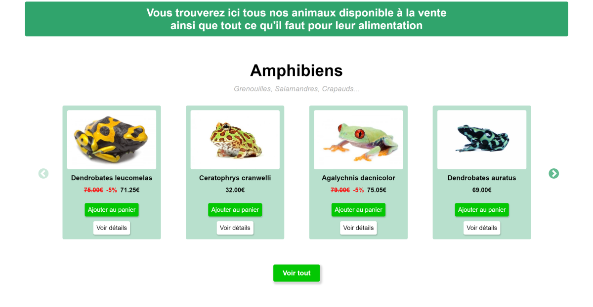
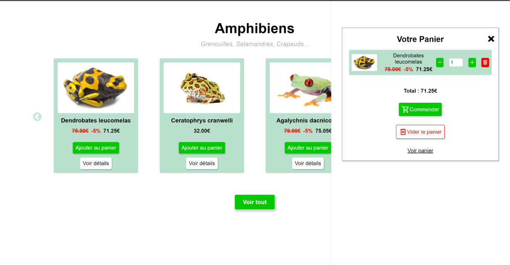
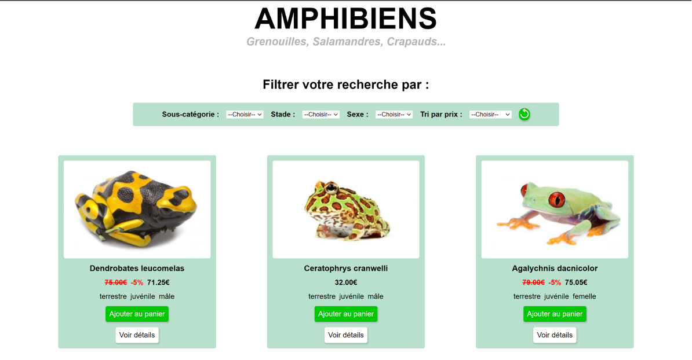
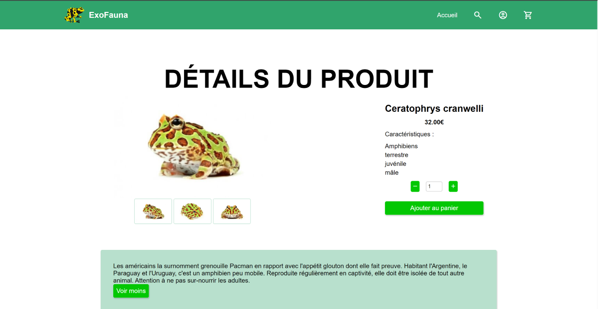

# ExoFauna

ExoFauna est un projet développé dans le cadre d'un cours visant à pratiquer les compétences en développement web telles que JavaScript, HTML et SCSS. L'objectif était de créer une petite boutique en ligne avec quelques fonctionnalités spécifiées dans un cahier des charges.

## Fonctionnalités

- **Boutique en ligne :** Le projet propose une interface utilisateur pour parcourir et acheter des produits de la boutique.

- **Gestion du panier :** Les utilisateurs peuvent ajouter des produits à leur panier et procéder à la commande pour finaliser leur achat.

- **Pages produit détaillées :** Chaque produit dispose d'une page détaillée avec des informations telles que la description, le prix, les options disponibles, etc.

- **Pages catégories avec fonctionnalités de tri :** Le projet inclut des pages de catégories avec des fonctionnalités de tri pour faciliter la recherche des utilisateurs.

- **Différents types de carrousels avec Slick :** Le projet utilise le plugin Slick pour mettre en place différents types de carrousels, offrant ainsi une expérience utilisateur interactive.

## Technologies utilisées

- **JavaScript :** Utilisé pour la logique côté client, y compris la gestion du panier, l'interaction avec les produits, etc.

- **HTML :** Langage de balisage utilisé pour structurer le contenu des pages web.

- **SCSS :** Utilisé pour styliser les éléments de l'interface utilisateur et appliquer des feuilles de style.

## Remarque

Ce projet est principalement destiné à des fins pédagogiques et de démonstration. Il ne comprend pas de fonctionnalités complètes de commerce électronique ou de paiement en ligne réel.

## Petit aperçu 👀

 